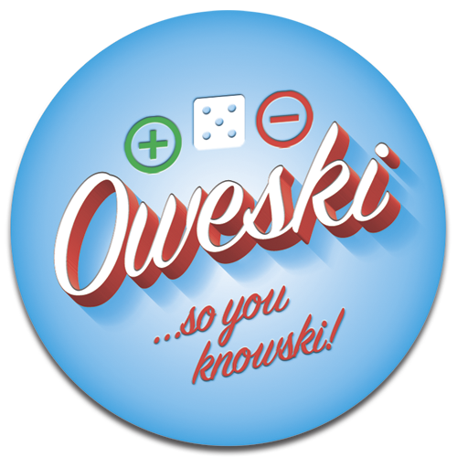

# OweSki - Front-End Capstone Project
## Rich Browser Applications /   &  
### [NSS](http://nashvillesoftwareschool.com/) Cohort D14 / Instructor - [Joe Shephard](https://github.com/JoeShep) / Advisors - [Christina Young](https://github.com/ChristinaJYoung) & [Callan Morrison](https://github.com/morecallan)  

  

[Check it out at OweSki.me](https://oweski-180c3.firebaseapp.com) soon! Currently hosted on Firebase... 

## PROPOSAL
### OweSki - “...so you KnowSki”
When two people go to lunch, get beers, buy a soda, etc., and one of the people buys and says “you get the next one”: OweSki is a way for both parties to track who owes whom. 
### OweSki Snapshot
OweSki is basically a “who’s turn is it?” tracker. 
Someone bought lunch? +1 to buyer / -1 to beneficiary

### NOTES
- OweSki is an idea I’ve had for a while now. A best friend and I have had a “mental” OweSki going for a while, and I’ve always intended to make it an application at some point; why not now?
- I see this as a phone app eventually, but functionally it could/should work just as well as a web app (make it responsive!) 

## REQUIREMENTS
1. Must have the ability to register a user in Firebase
1. Must have the ability to log in
1. You must be able to add OweSkis
1. You must use Firebase to store credits/dollar amounts
1. You must be able to add categories
1. You must be able to remove categories
1. Each OweSki must have the following properties
   1. tokenId
   1. positive value for one user and opposite for the other
   1. A boolean value that, if true, means that user has the positive or negative token value
1. It must be written with Angular
1. For the layout, should probably use Bootstrap
